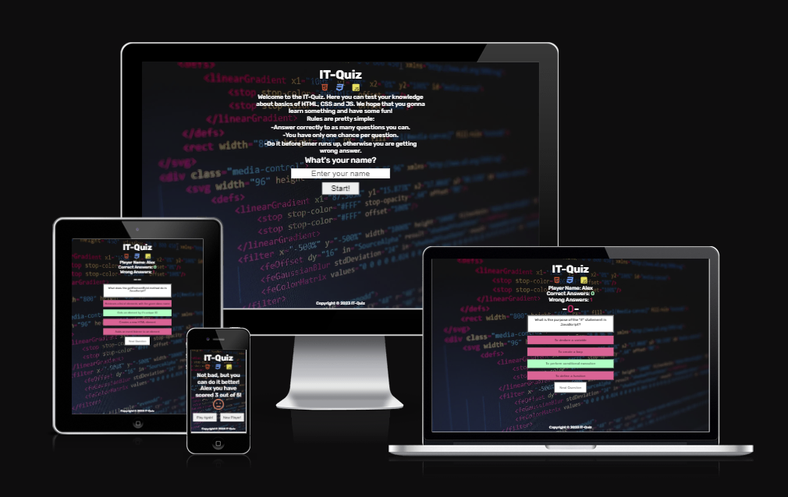

# IT-Quiz

IT-Quiz is a simple quiz/game where player needs to answer 5 random questions. Time for each quesiton/answer is 15 secs, to make it a little more intense.

This quiz is for everyone who wants to test own knowledge about basics of HTML, CSS and JavaScript and also have some fun.

[IT-Quiz live project here.](https://aleksandarjavorovic.github.io/portfolio-project-2/)

## **Table of Content**

### [**User Experience (UX)**](#user-experience-ux-aa)

- [User Stories](#user-stories)
- [Design](#design)
- [Wireframes](#wireframes)

### [**Features**](#features-aa)

- [Index Page](#index-page)
- [Footer](#footer)
- [Further Improvements](#further-improvements)

### [**Technologies Used**](#technologies-used-aa)

- [Languages Used](#languages-used)
- [Frameworks, Libraries and Programs Used](#frameworks-libraries-and-programs-used)

### [**Testing**](#testing-aa)

- [Validation Results](#validation-results)
- [Manual Testing](#manual-testing)
- [Fixed Bugs](#fixed-bugs)
- [Knows Bugs](#known-bugs)
- [Lighthouse Reports](#lighthouse-reports)

### [**Deployment and local development**](#deployment-and-local-development-aa)

- [GitHub Pages](#github-pages)
- [Forking the GitHub Repository](#forking-the-github-repository)

### [**Credits**](#credits-aa)

- [Content](#content)
- [Media](#media)

## **User Experience (UX)**

The title/heading of the site and icons of HTML, CSS and JavaScript indicate what the user/player can expact from the quiz itself.

Under the intro, there are few lines of simple rules describing how it's going to work and what to pay attention to.

Right under the rules is the input field to enter the players name with a clear question:"What's your name?" and placeholder:"Enter your name". The input field is prefocused, making it even easier for the player without need to click it first to be able to enter the name.

The buttons are designed so that it is easily understandable what do they present and what are their functions. Appropriate styles and colors are used to make it even clearer.

### **User Stories**

- **User/Player goals**

  - Be able to play fun/educative quiz
  - Be able to understand the rules of the quiz
  - Be able to enter the name
  - Be able to track my progress
  - Be able to see how much time is left to answer given question
  - Be able to see correct and incorrect answers
  - Be able to see my final score
  - Be able to play again or change user name in case there is more of us

- **Creator goals**

  - Present the content in a easy manner
  - Rules are easily understandable
  - Clear indication about time left to give answer
  - Clear indication about correct/incorrect asnwers
  - Clear presentation of current score
  - Let the player know how well they performed
  - Give the player option to play again or change the name if desired
  - Main goal is to offer some fun and education

  