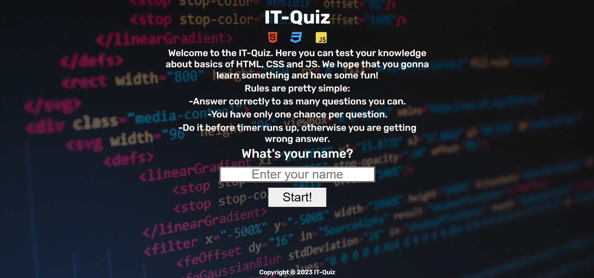
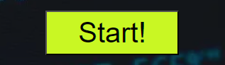

# IT-Quiz

IT-Quiz is a simple quiz/game where player needs to answer 5 random questions. Time for each quesiton/answer is 15 secs, to make it a little more intense.

This quiz is for everyone who wants to test own knowledge about basics of HTML, CSS and JavaScript and also have some fun.

[IT-Quiz live project here.](https://aleksandarjavorovic.github.io/portfolio-project-2/)

## **Table of Content**

### [**User Experience (UX)**](#user-experience-ux-aa)

- [User Stories](#user-stories)
- [Design](#design)
- [Wireframes](#wireframes)

### [**Features**](#features-aa)

- [Main Area](#main-area)
- [Heading](#heading)
- [Intro](#intro)
- [Rules](#rules)
- [Username Input](#username-input)
- [Start Button](#start-button)
- [Quiz Area](#quiz-area)
- [Player Name, Correct and Wrong Answers](#player-name-correct-and-wrong-answers)
- [Timer](#timer)
- [Questions/Answers Section](#questionsanswers-section)
- [Show Score Button](#show-score-button)
- [Score Area](#score-area)
- [Play Again/New Player Button](#play-againnew-player-button)
- [Footer](#footer)
- [Further Improvements](#further-improvements)

### [**Technologies Used**](#technologies-used-aa)

- [Languages Used](#languages-used)
- [Frameworks, Libraries and Programs Used](#frameworks-libraries-and-programs-used)

### [**Testing**](#testing-aa)

- [Validation Results](#validation-results)
- [Lighthouse Reports](#lighthouse-reports)
- [Manual Testing](#manual-testing)
- [Fixed Bugs](#fixed-bugs)
- [Knows Bugs](#known-bugs)

### [**Deployment and local development**](#deployment-and-local-development-aa)

- [GitHub Pages](#github-pages)
- [Forking the GitHub Repository](#forking-the-github-repository)

### [**Credits**](#credits-aa)

- [Content](#content)
- [Media](#media)

## **User Experience (UX)**

The title/heading of the site and icons of HTML, CSS and JavaScript indicate what the user/player can expact from the quiz itself.

Under the intro, there are few lines of simple rules describing how it's going to work and what to pay attention to.

Right under the rules is the input field to enter the players name with a clear question:"What's your name?" and placeholder:"Enter your name". The input field is prefocused, making it even easier for the player without need to click it first to be able to enter the name.

The buttons are designed so that it is easily understandable what do they present and what are their functions. Appropriate styles and colors are used to make it even clearer.

### **User Stories**

- **User/Player goals**

  - Be able to play fun/educative quiz
  - Be able to understand the rules of the quiz
  - Be able to enter the name
  - Be able to track my progress
  - Be able to see how much time is left to answer given question
  - Be able to see correct and incorrect answers
  - Be able to see my final score
  - Be able to play again or change user name for any reason

- **Creator goals**

  - Present the content in a understandable manner
  - Rules are easily understandable
  - Clear indication about time left to give answer
  - Clear indication about correct/incorrect asnwers
  - Clear presentation of current score
  - Let the player know how well they performed
  - Give the player option to play again or change the name if desired
  - Main goal is to offer some fun and education

### **Design**

- **Typography**

  - The fonts used are Rubik and sans-serif as a backup font in case there are issues related to importing.

- **Imagery**

  - The background image used presents clearly the theme of the quiz, which is coding in general.

- **Color Scheme**

  - The colors dominating throughout the quiz are presented under:

  - 
  - 

### **Wireframes**

- **Mobile Phone**
  

  
main-section
  

  
  

  

  
quiz-section
  

  
  

  

  
score-section
  

  
  

- **Tablet**
  

  
main-section
  

  
  

  

  
quiz-section
  

  
  

  

  
score-section
  

  
  

- **Desktop**

  

  
main-section
  

  
  

  

  
quiz-section
  

  
  

  

  
score-section
  

  
  

## **Features**

The IT-Quiz is designed according to responsive-design and UX-design approach to fit the needs of the most users nowdays. The whole site has only one page with multiple sections show/hiden as needed.

### **Main Area**

Main area is sort of a home page, the content user sees first, when he lands on the site. Starting with header, then comes intro paragraph, rules and after that comes section to input the name of the player.

  - Mobile Phone
  - 

  - Desktop
  - 

### **Heading**

Heading together with the icons persist throughout the site. As already mentioned clearly indicating the theme of the quiz.

- 

### **Intro**

Intro paragraph telling the user what can be expected.

- 

### **Rules**

The rules are simple as can be seen at the screenshot under:

- 

### **Username Input**

This part is also easy understandable, you need to enter your name in the filed intended for it. The field is also prepopulated with placeholder telling you to enter your name.

- 

Some of the additional features, accomplished via html element properties are:
  - Your name can't be less than 2  or more than 20 characters long.

  - 

  - You can't play without an username.

  - 

### **Start Button**

After entering your name, start button takes you to the Quiz Area and starts the Quiz!

- 

### **Quiz Area**

As Start button is pressed Main Area is getting hidden and Quiz Area shows up. Here we have section with the Player Name, under that we have Correct and Wrong answers counters. Right under comes Timer and then section with question and 4 answers. Next Question button is hidden until the player answers the question.

  - Mobile Phone

  - 

  - Desktop

  - 

### **Player Name, Correct and Wrong Answers**

This is section wich containes the player name and counters for Correct and Wrong answers colored accordingly for easier perception.

- 

### **Timer**

Timer is here to make this quiz a little more intense, counting down from 15. When the Timer hits 5th sec, font changes color indicating that player is about to run out of time. If the Timer runs out, it is counted as Wrong Answer. The Timer gets reseted after the Next Question Button is pressed.

- 

### **Questions/Answers Section**

The question and answers fields are white with a hover effect which changes color to lime and a pointer type cursor for a better UX. After the player answers the question or the Timer runs up, answers are getting colored accordingly and Next Question button is displayed. We are getting total of 5 questions we need to answer to get to the end of the quiz.

- Before the Answer

- 

- After the Answer

- 

### **Show Score Button**

After the player gives the answer to the 5th question, Next Question button will appear but as a Show Score button, which will take us to the Score Area.

- 

### **Score Area**

Score area will show a message and smiley icon according to the performance of the player. Under the smiley icon are Play Again and New Player buttons.

  - Mobile Phone

  - 

  - Desktop

    - Excellent Score
    - 

    - Very Good Score

    - 

    - Low Score

    - 

### **Play Again/New Player Button**

Play Again button allows the player to play again if desired, takes the player to the Quiz Area and resets the score. New Player button is there if the player wants to change the name for any reason, it takes the player to the Main Area.

- 

### **Footer**

Copyright details

- 

### **Further Improvements**

  - Add more questions for more diversity
  - Add sound effects for correct and wrong answers
  - Add sound effect for the Score Area according to the results
  - Add a score list where players could compare themself with the others

## **Technologies Used**

### **Languages Used**

  - CSS
  - HTML
  - JavaScript

### **Frameworks, Libraries and Programs Used**

1. [Google Fonts](https://fonts.google.com/)
   - Used to import "Rubik" font.
2. [Font Awesome](https://fontawesome.com/)
   - Used to add icons for UX and aesthetic purposes.
3. [Favicon.io](https://favicon.io/)
   - Used to create favicon for the website.
4. [Git](https://git-scm.com/)
   - Used for version control, commit to Git and Push to GitHub.
5. [GitHub](https://github.com/)
   - Used to store the code online and for deployment.
6. [Balsamiq](https://balsamiq.com/)
   - Used to create frames for the site in the designing process.
7. [Am I Responsive](https://ui.dev/amiresponsive)
   - Used to create mockup image for the README file.
8. [Codeanywhere](https://codeanywhere.com/)
   - Used for development as a cloud IDE
9. [Gitpod](https://www.gitpod.io/)
   - Used for development as a cloud IDE

## **Testing**

The W3C Markup Validator, W3C CSS Validator Services as well as JShint were used to validate the project to ensure there were no syntax errors in the project.

- [W3C Markup Validator](https://validator.w3.org/)
- [W3C CSS Validator](https://jigsaw.w3.org/css-validator/)
- [JShint](https://jshint.com/)

### **Validation Results**

  

  
W3C-HTML
  

  
  
  

  

  
W3C-Jigsaw-CSS
  

  
  
  

  

  
JShint
  

  
  
  

### **Lighthouse Reports**

#### **Mobile Analysis**

index.html

  

#### **Desktop Analysis**

index.html

  

### **Manual Testing**

| Feature  | Action/State | Result |
| ------------- | ------------- |-------------|
| Start Button | Click | Not possible to start without a name |
| Start Button | Click | Possible with a username between 2 and 20 characters long |
| Start Button | Click | Button displays Quiz Area and hides Main Area |
| Start Button | Click | Starts the Timer and displays the questions and answers |
| Timer | Out of time | Increases Wrong Asnwers status |
| Timer | Out of time | Displays the correct and wrong answers colors |
| Timer | Out of time | Disables the answer buttons to prevent multiple answers |
| Timer | Out of time | Displays Next Question button / Show Score button |
| Answer Button | Click | Colors the answer buttons accordingly |
| Answer Button | Click | Increases Correct or Wrong Answers status |
| Answer Button | Click | Disables the answer buttons to prevent multiple answers |
| Answer Button | Click | Stops the timer if there is any time left |
| Answer Button | Click | Displays Next Question button / Show Score button |
| Next Question Button | Click | Resets the Timer |
| Next Question Button | Click | Displays next question and answers in their fields |
| Next Question Button | Click | The button itself gets hidden |
| Show Score button | Click | Displays the Score Area and hides the Quiz Area |
| Show Score Button | Click | Displays the message according to the score of the player |
| Show Score Button | Click | Displays Play Again and New Player buttons |
| Play Again Button | Click | Displays the Quiz Area and hides the Score Area |
| Play Again Button | Click | Resets the score status and Timer |
| Play Again Button | Click | Displays quesiton and answers in their fields |
| New Player Button | Click | Displays the Main Area and hides the Score Area |
| New Player Button | Click | Resets the username input field |
| All Buttons | Hover | Button color changes to Lime and cursor to pointer style |

#### **Further Manual Testing**

- The site was tested on variaty of browsers such as: [Brave](https://brave.com/), [Microsoft Edge](https://www.microsoft.com/en-us/edge?ep=82&form=MA13KI&es=24&ch=1), [Opera GX](https://www.opera.com/gx) and [Safari](https://www.apple.com/safari/).
- The site was tested on many devices: Desktop PC, Laptop, Xiaomi12T, Iphone14, IphoneX. Thanks to responsive design approach the site looks good on all devices(except certain bugs on Iphones).
- Family members/friends were asked kindly to try out the site for additional feedback.

### **Fixed Bugs**

- There was a "invisible" paragraph which was causing extra spacing between paragraphs. Later I've found that one of the paragraphs was missing a closing tag.

  

  
Invisible paragraph
  

  
  
  

- In this case something was pushing New Player button down a little bit. This was sorted out using flex-box properties.

  

  
Unordered buttons
  

  
  
  

### **Known Bugs**

- aaa

## **Deployment and local development**

### **GitHub Pages**

1. Log in to GitHub and locate [GitHub Repository IT-Quiz](https://github.com/AleksandarJavorovic/portfolio-project-2)
2. At the navigation bar of the repository tab find "Settings", click.
3. At the left side under the "Code and automation" section, click on "Pages".
4. Next locate the "Source" and set it to "Deploy from a branch", branch should be "main", folder set to "root" and then click on the "Save" button.
5. Head back to the [Project Repository](https://github.com/AleksandarJavorovic/portfolio-project-2) and on the right side click on [Deployments](https://github.com/AleksandarJavorovic/portfolio-project-2/deployments) and under the "Active deployments" section is the freshly deployed project: [IT-Quiz](https://aleksandarjavorovic.github.io/portfolio-project-2/).

### **Forking the GitHub Repository**

By forking the GitHub Repository we can make a copy of the original repository to view or make changes without changing the original repository.

1. Log in to GitHub and locate [GitHub Repository IT-Quiz](https://github.com/AleksandarJavorovic/portfolio-project-2)
2. At the top, in the line with the project's name, on the right side find "Fork", click.
3. Now you have a copy of the original repository in your GitHub account.

## **Credits**

Thanks to my mentor Mitko Bachvarov for tips and suggestions.

### **Content**

- Some things were inspired by [This video](https://www.youtube.com/watch?v=PBcqGxrr9g8).
- Some things were inspired by [Love Maths](https://github.com/AleksandarJavorovic/love-maths) project.
- This article [JavaScript Recursive Function](https://www.javascripttutorial.net/javascript-recursive-function/) has helped me to sort my getRandomQuestion function.
- Other links which contributed to this project:
  - [How to disable HTML button using JavaScript?](https://stackoverflow.com/questions/3014649/how-to-disable-html-button-using-javascript)
  - [How to create a counter in JavaScript – Multiple methods](https://digifisk.com/counter-in-javascript/)
  - [How to create a simple JavaScript timer?](https://stackoverflow.com/questions/31559469/how-to-create-a-simple-javascript-timer)
  - [JavaScript: 2 Ways to Get a Random Element from an Array](https://www.slingacademy.com/article/javascript-ways-to-get-a-random-element-from-an-array/)
  - [How can I set focus on an element in an HTML form using JavaScript?](https://stackoverflow.com/questions/17500704/how-can-i-set-focus-on-an-element-in-an-html-form-using-javascript)
- Readme files which were used as inspiration:
  - [RPSLS](https://github.com/ElinaBoman/rps2/blob/main/README.md)
  - [LYRICAL BLANKETY BLANK](https://github.com/rachaelbabister/lyric-quiz/blob/main/README.md)
  - [Visit Järbo](https://github.com/ClaudiaInSweden/visit-jarbo/blob/main/README.md)
  - [XYZcellent Solutions](https://github.com/AleksandarJavorovic/portfolio-project-1/blob/main/README.md)

### **Media**

- Background photo is downloaded from: [Unsplash](https://unsplash.com/).